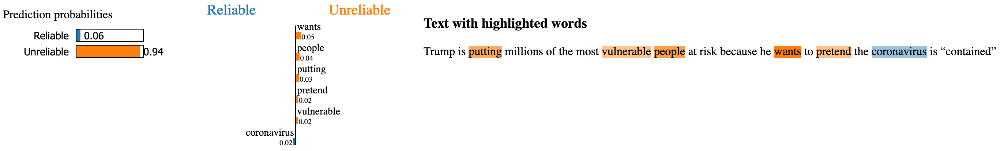

```{r setup, include=FALSE}
knitr::opts_chunk$set(echo = FALSE)
```

## 
](./twitter_misinfo_1.jpg)

##


## Dataset from Boukouvalas et al. (2020) ^[The [data](https://zoisboukouvalas.github.io/COVID19_Twitter_Dataset.xlsx) are available online at Dr. Boukouvalas' [website](https://zoisboukouvalas.github.io/Code.html).]
- 560 tweets, perfectly balanced classes
- sample of 282,201 users in Canada
- tweets posted between January 1 - March 13, 2020
- manually labeled as "reliable" or "unreliable"

## 
\begin{footnotesize}
\begin{table}[htp]
 \caption{Misinformation rules from Boukouvalas et al. (2020)}
  \centering
  \begin{tabular}{p{4cm}|p{6cm}}
    \hline
    \textbf{Linguistic Feature} & \textbf{Example from Dataset} \\ [0.5 ex]
    \hline\hline
    Hyperbolic, intensified, superlative, or emphatic language & e.g., ‘blame’, ‘accuse’, ‘refuse’, ‘catastrophe’, ‘chaos’, ‘evil’ \\
    \hline
    Greater use of punctuation and/or special characters & e.g., e.g., ‘YA THINK!!?!!?!’, ‘Can we PLEASE stop spreading the lie that Coronavirus is super super super contagious? It’s not. It has a contagious rating of TWO’ \\
    \hline
    Strongly emotional or subjective language & e.g., ‘fight’, ‘danger’, ‘hysteria’, ‘panic’, ‘paranoia’, ‘laugh’, ‘stupidity’ or other words indicating fear, surprise, alarm, anger, and so forth \\
    \hline
    Greater use of verbs of perception and/or opinion & e.g., ‘hear’, ‘see’, ‘feel’, ‘suppose’, ‘perceive’, ‘look’, ‘appear’, ‘suggest’, ‘believe’, ‘pretend’ \\
    \hline
  \end{tabular}
  \label{tab:table1words}
\end{table}
\end{footnotesize}

## Overview

- raw text
- word embeddings
    - word-word co-occurrence matrix
    - latent variable methods
- tweet embeddings
- classification
- evaluation

## Word-Context Matrix
](./word_context_matrix.png){#id .class width=70% height=70%}

## Latent Variable Methods
\begin{figure}
  \centering
  \matbox{3}{3}{n}{n}{X} $\xrightarrow{\text{PCA}}$ \matbox{2}{3}{k}{n}{\widetilde{X}} $\xrightarrow{\text{ICA}}$ \matbox{3}{2}{n}{k}{\mathbf{\hat{S}}^T}
  \caption{Truncated Singular Value Decomposition followed by Independent Component Analysis.}
  \label{fig:latvar}
\end{figure}

## Tweet Embeddings
A tweet embedding is the average of the word embeddings for the words that occur in that tweet.
$$\mathbf{v}_i=\frac {1} {T_i} \sum_{j=1}^{T_i}{\mathbf{s}_j}$$
Example tweet: "Covid is fake news."
$$\mathrm{tweet} \begin{bmatrix} v_{i1} \\ \vdots \\ v_{ik} \end{bmatrix} = \frac {\mathrm{covid} \begin{bmatrix} s_{11} \\ \vdots \\ s_{1k} \end{bmatrix} + \mathrm{is} \begin{bmatrix} s_{21} \\ \vdots \\ s_{2k} \end{bmatrix} + \mathrm{fake} \begin{bmatrix} s_{31} \\ \vdots \\ s_{3k} \end{bmatrix} + \mathrm{news} \begin{bmatrix} s_{41} \\ \vdots \\ s_{4k} \end{bmatrix}} {4}$$

## LIME: Local Explainability


## ICA: Global Explainability
We define the importance of the $i^{th}$ target word as follows:
$$g_i = \frac {1}{k} \sum_{j=1}^{k}{|s_{ji}|}$$
where $k$ is the number of SVD features (and therefore the number of ICA features), and $|s_{ji}|$ is the magnitude of the $i^{th}$ word's importance in topic $j$.

## Example: Tweet 170
CNBC ADVICE NOW: Coronavirus is the flu. Wash your hands. Book a vacation. We’ll look back on this and laugh.

{#id .class width=70% height=70%}

## Explainability metric
Goal: value that captures how "explainable" a classifier's predictions are (with respect to human classification)

$$\frac{1}{N} \sum_{i=1}^{N} \frac{1}{T_i} \sum_{j=1}^{T_i} \mathbbm{1}_{A_i}(w_j)$$
where there are $T_i$ table 1 words in tweet $i$, $w_j$ is the $j^{th}$ table 1 word in tweet $i$, $A_i$ is the set of words that the classifier associated with the unreliable class according to LIME for tweet $i$, and there are $N$ tweets.

## Results
\begin{table}
 \caption{One-class classification}
  \centering
  \begin{tabular}{|c|c|c|c|c|c|}
    \hline
    \textbf{Model} & \textbf{AUC} & \textbf{Accuracy} & \textbf{F1} & \textbf{Precision} & \textbf{Recall} \\
    \hline
    OCSVM & 0.750 & 0.671 & 0.629 & 0.709 & 0.671 \\
    \hline
    Isolation Forest & 0.643 & 0.552 & 0.616 & 0.673 & 0.552 \\
    \hline
    LOF & 0.658 & 0.539 & 0.552 & 0.598 & 0.539 \\
    \hline
  \end{tabular}
  \label{tab:oc}
\end{table}

OCSVM used word embeddings of length 100; isolation forest and LOF used embeddings of length 50.

## Results (continued)
\begin{table}
 \caption{Binary SVM performance}
  \centering
  \begin{tabular}{|c|c|c|c|c|c|}
    \hline
    \textbf{Dimensions} & \textbf{AUC} & \textbf{Accuracy} & \textbf{F1} & \textbf{Precision} & \textbf{Recall} \\
    \hline
    50 & 0.903 & 0.804 & 0.801 & 0.818 & 0.804 \\
    \hline
    100 & 0.911 & 0.796 & 0.793 & 0.817 & 0.796 \\
    \hline
    150 & 0.906 & 0.795 & 0.792 & 0.810 & 0.795 \\
    \hline
    200 & 0.901 & 0.800 & 0.798 & 0.815 & 0.800 \\
    \hline
    250 & 0.904 & 0.807 & 0.804 & 0.827 & 0.807 \\
    \hline
    500 & 0.908 & 0.789 & 0.785 & 0.814 & 0.789 \\
    \hline
  \end{tabular}
  \label{tab:svm}
\end{table}

## Results (continued)
Two experiments: (1) used strictly table 1 words, and (2) used table 1 words plus related terms. Both used stemming.

\begin{table}
 \caption{Binary SVM explainability}
  \centering
  \begin{tabular}{|c|c|c|}
    \hline
    \textbf{Experiment} & \textbf{Explainability Score} \\
    \hline
    1: Correctly predicted & 0.593 \\
    \hline
    1: Wrongly predicted & 0.500 \\
    \hline
    1: Aggregated & 0.588 \\
    \hline
    2: Correctly predicted & 0.619 \\
    \hline
    2: Wrongly predicted & 0.407 \\
    \hline
    2: Aggregated & 0.608 \\
    \hline
  \end{tabular}
  \label{tab:expl}
\end{table}

## Future work

- local ICA explainability
- different word embeddings (e.g., BERT)
- different classifiers (e.g., neural net)
- improve explainability metric

