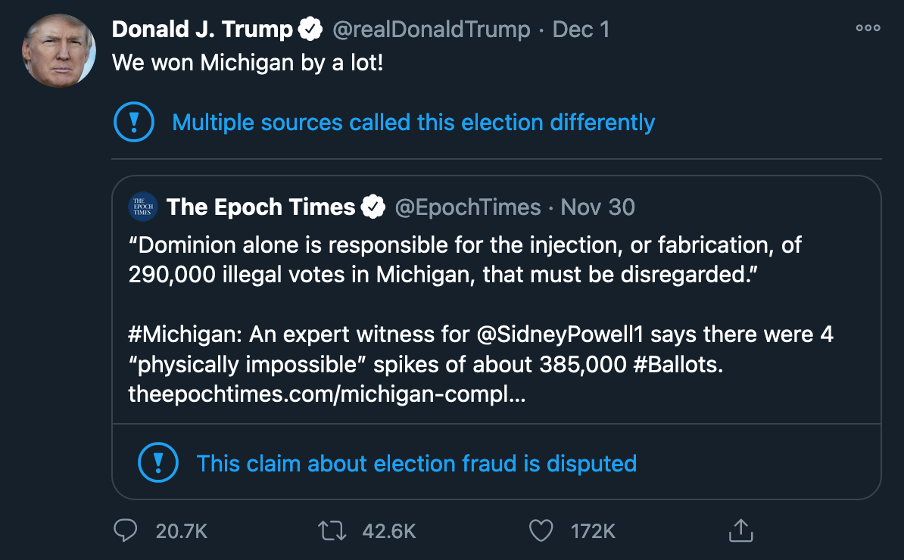
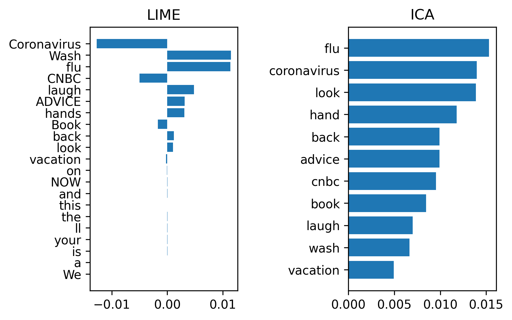

```{r setup, include=FALSE}
knitr::opts_chunk$set(echo = FALSE)
```

## 


## Dataset
- 560 tweets, perfectly balanced classes
- sample of 282,201 users in Canada
- tweets posted between January 1 - March 13, 2020
- manually labeled as "reliable" or "unreliable"

## 
\begin{table}[htp]
 \caption{Misinformation rules from Boukouvalas et al. (2020)}
  \centering
  \begin{tabular}{p{4cm}|p{6cm}}
    \hline
    \textbf{Linguistic Feature} & \textbf{Example from Dataset} \\ [0.5 ex]
    \hline\hline
    Hyperbolic, intensified, superlative, or emphatic language & e.g., ‘blame’, ‘accuse’, ‘refuse’, ‘catastrophe’, ‘chaos’, ‘evil’ \\
    \hline
    Greater use of punctuation and/or special characters & e.g., e.g., ‘YA THINK!!?!!?!’, ‘Can we PLEASE stop spreading the lie that Coronavirus is super super super contagious? It’s not. It has a contagious rating of TWO’ \\
    \hline
    Strongly emotional or subjective language & e.g., ‘fight’, ‘danger’, ‘hysteria’, ‘panic’, ‘paranoia’, ‘laugh’, ‘stupidity’ or other words indicating fear, surprise, alarm, anger, and so forth \\
    \hline
    Greater use of verbs of perception and/or opinion & e.g., ‘hear’, ‘see’, ‘feel’, ‘suppose’, ‘perceive’, ‘look’, ‘appear’, ‘suggest’, ‘believe’, ‘pretend’ \\
    \hline
  \end{tabular}
  \label{tab:table1words}
\end{table}

## Methodology

- raw text
- word embeddings
    - word-word co-occurrence matrix
    - latent variable methods
- tweet embeddings
- classification
- evaluation

## Word-Word Co-Occurrence Matrix

- text cleaning: **remove stop words, lemmatize text, convert to lowercase, remove special characters**, remove punctuation
- context window size: 1, 2, 4, 6, 10, **15**, 20
- weighting: raw frequencies, **PMI**, PPMI
- Laplace smoothing: add-1, add-2
- shifted or **unshifted**: k = 5, **k = 1**
- **start/end tokens**

## Latent Variable Methods
\begin{figure}
  \centering
  \matbox{3}{3}{n}{n}{X} = 
  \matbox{3}{2}{n}{k}{U} \raiserows{0.5}{\matbox{2}{2}{k}{k}{D}}
  \raiserows{0.5}{\matbox{2}{3}{k}{n}{V^T}}
  \newline
  \newline
  \newline
  \matbox{3}{2}{n}{k}{U} = 
  \matbox{3}{2}{n}{k}{A} \raiserows{0.5}{\matbox{2}{2}{k}{k}{S}}
  \caption{Truncated Singular Value Decomposition followed by Independent Component Analysis.}
  \label{fig:matdec}
\end{figure}

## Tweet Embeddings
$$\mathbf{v}_i=\frac {1} {T_i} \sum_{j=1}^{T_i}{\mathbf{e}_j}$$

## Classification

- One-class classification: one-class support vector machines (OCSVM), isolation forest, & local outlier factor (LOF)
- Binary classification: SVM
- Evaluation: performance & explainability

## LIME: Local Explainability

## ICA: Global Explainability
We define the importance of the $i^{th}$ target word as follows:
$$g_i = \frac {1}{k} \sum_{j=1}^{k}{|a_{ij}|}$$
where $k$ is the number of SVD features (and therefore the number of ICA features), and $|a_{ij|}$ is the magnitude of the $i^{th}$ word's importance in topic $j$.

## Example
Tweet 170: CNBC ADVICE NOW: Coronavirus is the flu. Wash your hands. Book a vacation. We’ll look back on this and laugh.

{#id .class width=75% height=75%}

## Explainability metric
Goal: value that captures how "explainable" a classifier's predictions are (with respect to human classification)

With penalty:
$$\frac{1}{N} \sum_{i=1}^{N} \frac{1}{T_i} \sum_{j=1}^{T_i} \mathbbm{1}_A(w_j) - \mathbbm{1}_B(w_j)$$

No penalty:
$$\frac{1}{N} \sum_{i=1}^{N} \frac{1}{T_i} \sum_{j=1}^{T_i} \mathbbm{1}_A(w_j)$$
where $A$ is the set of words that the classifier associated with the correct class (e.g., tweet $i$ is labeled as “reliable,” and the classifier classified the tweet as “reliable”) according to the LIME output for tweet $i$, $B$ is the set of words that the classifier associated with the wrong class according to the LIME output for tweet $i$, there are $T_i$ words in tweet $i$, and there are $N$ tweets.

## Results
\begin{table}
 \caption{One-class classification}
  \centering
  \begin{tabular}{|c|c|c|c|c|c|}
    \hline
    \textbf{Model} & \textbf{AUC} & \textbf{Accuracy} & \textbf{F1} & \textbf{Precision} & \textbf{Recall} \\
    \hline
    OCSVM & 0.750 & 0.671 & 0.629 & 0.709 & 0.671 \\
    \hline
    Isolation Forest & 0.643 & 0.552 & 0.616 & 0.673 & 0.552 \\
    \hline
    LOF & 0.658 & 0.539 & 0.552 & 0.598 & 0.539 \\
    \hline
  \end{tabular}
  \label{tab:oc}
\end{table}

OCSVM used word embeddings of length 100; isolation forest and LOF used embeddings of length 50.

## Results (continued)
\begin{table}
 \caption{Binary SVM performance}
  \centering
  \begin{tabular}{|c|c|c|c|c|c|}
    \hline
    \textbf{Dimensions} & \textbf{AUC} & \textbf{Accuracy} & \textbf{F1} & \textbf{Precision} & \textbf{Recall} \\
    \hline
    50 & 0.903 & 0.804 & 0.801 & 0.818 & 0.804 \\
    \hline
    100 & 0.911 & 0.796 & 0.793 & 0.817 & 0.796 \\
    \hline
    150 & 0.906 & 0.795 & 0.792 & 0.810 & 0.795 \\
    \hline
    200 & 0.901 & 0.800 & 0.798 & 0.815 & 0.800 \\
    \hline
    250 & 0.904 & 0.807 & 0.804 & 0.827 & 0.807 \\
    \hline
    500 & 0.908 & 0.789 & 0.785 & 0.814 & 0.789 \\
    \hline
  \end{tabular}
  \label{tab:svm}
\end{table}

## Results (continued)
\begin{table}
 \caption{Binary SVM explainability}
  \centering
  \begin{tabular}{|c|c|c|}
    \hline
    \textbf{Experiment} & \textbf{Penalty} & \textbf{No Penalty} \\
    \hline
    1: Correctly predicted & 0.331 & 0.534 \\
    \hline
    1: Wrongly predicted & 0.222 & 0.278 \\
    \hline
    1: Aggregated & 0.326 & 0.521 \\
    \hline
    2: Correctly predicted & 0.356 & 0.593 \\
    \hline
    2: Wrongly predicted & 0.074 & 0.315 \\
    \hline
    2: Aggregated & 0.342 & 0.579 \\
    \hline
    3a: Correctly predicted & 0.396 & 0.593 \\
    \hline
    3a: Wrongly predicted & 0.444 & 0.500 \\
    \hline
    3a: Aggregated & 0.399 & 0.588 \\
    \hline
    3b: Correctly predicted & 0.378 & 0.619 \\
    \hline
    3b: Wrongly predicted & 0.148 & 0.407 \\
    \hline
    3b: Aggregated & 0.367 & 0.608 \\
    \hline
  \end{tabular}
  \label{tab:expl}
\end{table}

## Conclusion
Future work:

- local ICA explainability
- different word embeddings (e.g., BERT)
- different classifiers (e.g., neural net)

